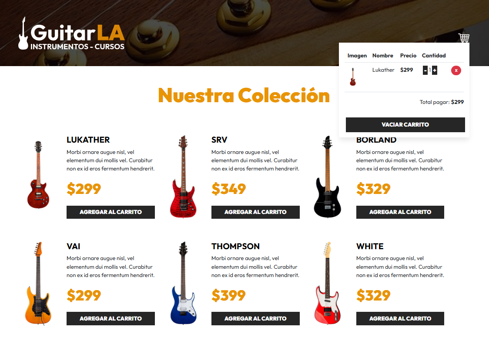

# 🎸 GuitarLA - Tienda de Guitarras Online

Bienvenido a **GuitarLA**, una aplicación web moderna para la venta de guitarras, desarrollada con **React**. Este proyecto forma parte de mi portafolio profesional y demuestra habilidades en desarrollo frontend, manejo de estado, persistencia local y experiencia de usuario.

---

## 🚀 Características principales

- **Catálogo interactivo:** Explora una colección de guitarras con imágenes, descripciones y precios.
- **Carrito de compras dinámico:** Añade, elimina y ajusta la cantidad de productos en tu carrito.
- **Persistencia:** El carrito se guarda automáticamente en el navegador (localStorage), ¡no pierdes tu selección al recargar!
- **Responsive Design:** Interfaz adaptada para dispositivos móviles y escritorio usando Bootstrap.
- **Límites inteligentes:** Controla la cantidad máxima y mínima de productos por artículo.
- **Código modular:** Componentes reutilizables y lógica bien estructurada.

---

## ⚛️ Características de React utilizadas

- **Componentes funcionales:** Toda la interfaz está construida con componentes funcionales para mayor claridad y reutilización.
- **Hooks:**
  - `useState` para gestionar el estado del catálogo y el carrito.
  - `useEffect` para sincronizar el carrito con localStorage y mantener la persistencia.
  - `useMemo` para cálculos derivados como el total del carrito y la verificación de si está vacío.
- **Props:** Comunicación eficiente entre componentes, pasando datos y funciones para manipular el estado global.
- **Renderizado condicional:** Muestra diferentes vistas según el estado del carrito (vacío o con productos).
- **Mapeo de arrays:** Renderiza dinámicamente la colección de guitarras y los productos en el carrito.

---

## 🛠️ Tecnologías utilizadas

- **React** (Hooks, componentes funcionales)
- **Vite** (entorno de desarrollo y build ultra rápido)
- **Bootstrap** (estilos y layout)
- **JavaScript ES6+**
- **localStorage** (persistencia del carrito)

---

## 📁 Estructura del proyecto

```
src/
├── components/
│   ├── Header.jsx
│   └── Guitar.jsx
├── data/
│   └── db.js
├── App.jsx
```

---

## 👨‍💻 Sobre mí

Soy desarrollador **Fullstack** apasionado por crear experiencias web intuitivas y funcionales. Me gusta estar en constante aprendizaje, explorando nuevas tecnologías y mejores prácticas para ofrecer soluciones modernas.

---

## 📷 Vista previa



---

## 📝 Instalación y uso

1. Clona el repositorio:
   ```
   git clone https://github.com/tuusuario/guitarla.git
   ```
2. Instala dependencias:
   ```
   npm install
   ```
3. Ejecuta la app:
   ```
   npm run dev
   ```

---

## 🌐 Demo en línea

Puedes ver la aplicación funcionando aquí:  
<a href="https://glittering-mooncake-e38b08.netlify.app/" target="_blank">https://glittering-mooncake-e38b08.netlify.app/</a>

---

## 📬 Contacto

¿Te gustaría saber más o colaborar?  
<a href="https://www.linkedin.com/in/jos%C3%A9-eduardo-mart%C3%ADnez-p%C3%A9rez-5694a0172/" target="_blank">LinkedIn</a> | <a href="mailto:ingsisjoseeduardo@outlook.com.com" target="_blank">Email</a>

---

**GuitarLA** - Todos los derechos reservados.  
¡Gracias por visitar mi portafolio!
